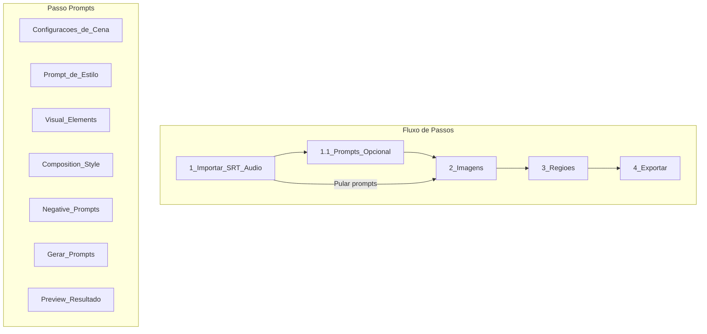

# Plano: Adicionar Passo de Geração de Prompts

## Visao Geral

Criar um novo passo opcional "Prompts" entre "Importar" e "Imagens" que permite gerar prompts para criacao de imagens de whiteboard animation usando IA (Claude/GPT/OpenRouter). O passo usara as legendas do SRT importado no passo 1 para gerar prompts contextualizados.

## Arquitetura



## Componentes a Criar

### 1. Novo arquivo: `src/components/wizard-new/PromptsStep.tsx`

Componente React para o passo de geracao de prompts. Incluira:

**Secao 1: Configuracoes de Cena**

- Dropdown "Elementos por cena": 2-4 (minimalista), 4-8 (padrao), 8-12 (detalhado)
- Dropdown "Aspect Ratio": 16:9 (horizontal), 9:16 (vertical), 1:1 (quadrado)
- Dropdown "Duracao das cenas": 15-30s (rapido), 25-50s (padrao), 40-60s (lento)

**Secao 2: Configuracao de IA**

- Dropdown "Provider": OpenAI, OpenRouter, Z.AI
- Dropdown "Modelo": lista dinamica baseada no provider selecionado
- Campo "API Key" (usa a mesma configuracao de `ApiConfig`)

**Secao 3: Prompt de Estilo (Cabecalho)**

- Textarea editavel com prompt de estilo padrao
- Suporta placeholders `{dimensions}` e `{aspect_ratio}`
- Botoes "Restaurar Padrao" e "Salvar"

**Secao 4: Visual Elements**

- Textarea editavel com cabecalho de elementos visuais
- Texto padrao descrevendo como elementos devem ser dispostos
- Botoes "Restaurar Padrao" e "Salvar"

**Secao 5: Composition Style**

- Textarea editavel com regras de composicao
- Texto padrao com regras de layout organico
- Botoes "Restaurar Padrao" e "Salvar"

**Secao 6: Negative Prompts**

- Textarea editavel com prompts negativos
- Lista de elementos a evitar nas imagens
- Botoes "Restaurar Padrao" e "Salvar"

**Secao 7: Acoes**

- Botao "Gerar Prompts" - chama IA para gerar prompts baseado no SRT
- Preview do resultado gerado
- Botao "Copiar Tudo" - copia resultado para clipboard
- Botao "Exportar .txt" - salva resultado em arquivo

### 2. Novo arquivo: `src/utils/promptGenerator.ts`

Utilitario para geracao de prompts:

```typescript
interface PromptConfig {
  elementsPerScene: string;  // "4-8"
  aspectRatio: string;       // "16:9"
  sceneDuration: string;     // "25-50"
  stylePrompt: string;
  visualElements: string;
  compositionStyle: string;
  negativePrompts: string;
}

interface GeneratedPrompt {
  sceneNumber: number;
  startTime: number;
  endTime: number;
  narrationText: string;
  visualElements: string[];
  imagePrompt: string;
}

// Funcoes principais
function generatePromptsFromSRT(
  subtitles: Subtitle[],
  config: PromptConfig,
  aiConfig: { provider: string; model: string; apiKey: string }
): Promise<GeneratedPrompt[]>

function divideIntoScenes(
  subtitles: Subtitle[],
  minDuration: number,
  maxDuration: number
): Scene[]

function formatOutputMarkdown(prompts: GeneratedPrompt[]): string
```

### 3. Atualizar: `src/types/ApiConfig.ts`

Adicionar configuracao para providers de geracao de prompts:

```typescript
export interface PromptGenerationConfig {
  provider: 'openai' | 'openrouter' | 'zai';
  model: string;
  enabled: boolean;
}

// Adicionar ao ApiConfig existente
export interface ApiConfig {
  // ... existente ...
  promptGeneration: PromptGenerationConfig;
}

// Constantes de modelos
export const OPENAI_MODELS = ['gpt-4o', 'gpt-4o-mini', 'gpt-4-turbo'];
export const OPENROUTER_MODELS = [
  'anthropic/claude-sonnet-4.5',
  'anthropic/claude-3.5-sonnet',
  'google/gemini-2.5-pro',
  // ...
];
```

### 4. Atualizar: `src/components/wizard-new/WizardAppNew.tsx`

- Adicionar novo step "prompts" na lista de steps
- Adicionar estado para dados de prompts gerados
- Renderizar `PromptsStep` quando step === 'prompts'
- Permitir pular o passo (ir direto para imagens)

**Alteracoes na navegacao:**

```typescript
type WizardStep = 'import' | 'prompts' | 'images' | 'regions' | 'export';

const STEPS = [
  { id: 'import', label: 'Importar', number: 1 },
  { id: 'prompts', label: 'Prompts', number: '1.1', optional: true },
  { id: 'images', label: 'Imagens', number: 2 },
  { id: 'regions', label: 'Regioes', number: 3 },
  { id: 'export', label: 'Exportar', number: 4 },
];
```

### 5. Atualizar: `src/components/settings/ApiSettings.tsx`

Adicionar secao para configurar providers de geracao de prompts:

- Dropdown de provider (OpenAI, OpenRouter, Z.AI)
- Campo de API Key para cada provider
- Dropdown de modelo padrao

## Valores Padrao (do Whiteboard Animation Agent)

**Prompt de Estilo:**

```
Whiteboard animation style illustration, {dimensions} ({aspect_ratio}), pure white background, hand-drawn sketch aesthetic. The art style should be 'graphic recording' or 'visual thinking' using black ink fine-liners for clear outlines and text. Use colored markers for simple shading and accents.
```

**Visual Elements:**

```
VISUAL ELEMENTS floating freely across the canvas in organic, natural arrangement - NOT in grid, NOT in sequence, NO connecting arrows between elements, NO elements in the border of the image. Each element self-contained and extractable. The images and texts should cover at least 70% of the image considering all elements.
```

**Composition Style:**

```
- Some elements angled or tilted slightly for dynamism
- Generous breathing room between elements
- NO rigid rows or columns
- Hand-drawn imperfect wobbly lines
- Combination between text and images
- All text labels in Brazilian Portuguese
```

**Negative Prompts:**

```
grid layout, flowchart style, connecting arrows between elements, sequential left-to-right arrangement, photorealistic, 3D render, symmetrical composition, hand drawing, drawing hand, pen, pencil, marker, hand holding pen, fingers drawing, artist hand visible
```

## Fluxo de Geracao

1. Usuario importa SRT no passo 1
2. Usuario vai para passo 1.1 (Prompts) - opcional
3. Configura elementos por cena, aspect ratio, duracao
4. Ajusta prompts de estilo se necessario
5. Clica em "Gerar Prompts"
6. Sistema divide SRT em cenas baseado na duracao configurada
7. Para cada cena, chama IA para gerar elementos visuais e prompt
8. Exibe preview do resultado
9. Usuario pode copiar/exportar resultado
10. Usuario avanca para passo 2 (Imagens)

## Arquivos a Modificar

- [src/components/wizard-new/WizardAppNew.tsx](src/components/wizard-new/WizardAppNew.tsx) - Adicionar novo step e navegacao
- [src/types/ApiConfig.ts](src/types/ApiConfig.ts) - Adicionar tipos para geracao de prompts
- [src/components/settings/ApiSettings.tsx](src/components/settings/ApiSettings.tsx) - Adicionar UI para config de prompts

## Arquivos a Criar

- `src/components/wizard-new/PromptsStep.tsx` - Componente do novo passo
- `src/utils/promptGenerator.ts` - Logica de geracao de prompts

## Persistencia

Os prompts customizados (estilo, visual elements, etc) serao salvos no localStorage junto com as outras configuracoes de API, usando a mesma estrutura de `ApiConfig`.